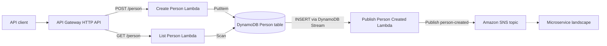
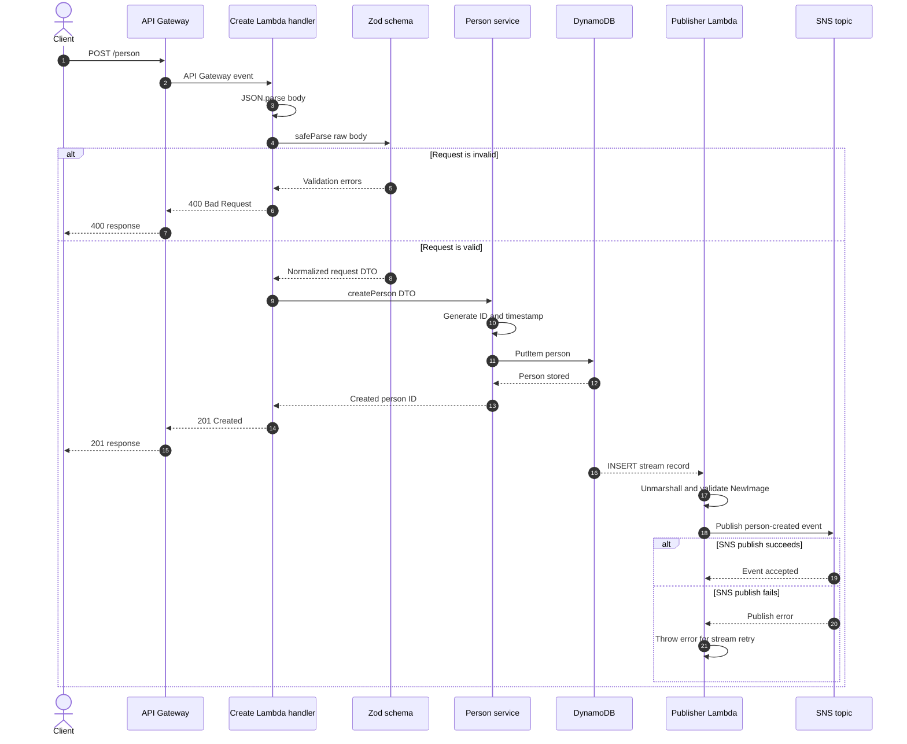
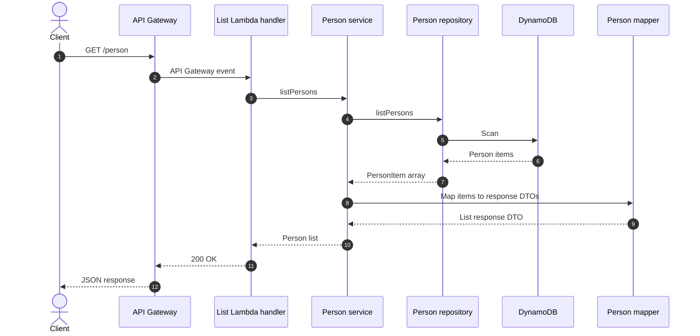
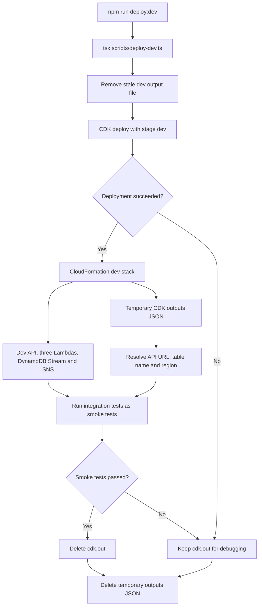
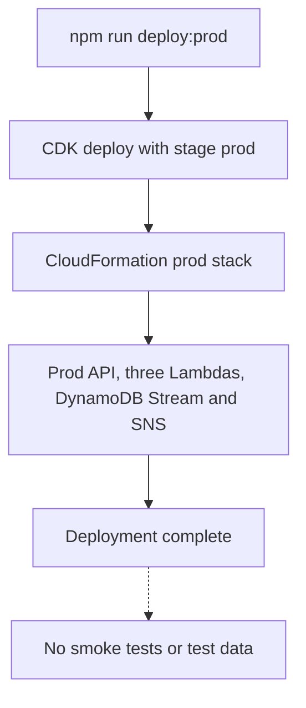

# Person Service

Serverless Person microservice built with AWS CDK and TypeScript. It exposes an
HTTP API for creating and listing persons, stores data in DynamoDB, and publishes
a `person-created` event to Amazon SNS after a person is created.

## Architecture



All infrastructure is defined in `infra/lib/person-service-stack.ts` and
deployed through AWS CloudFormation by CDK.

## Request Flows

### `POST /person`



Request parsing and validation happen in the Create Lambda. The DynamoDB write
is awaited before the API returns `201 Created`. Event publishing is
asynchronous: a successful insert produces a DynamoDB Stream record that
invokes the Publisher Lambda, so the API does not wait for SNS.

### `GET /person`



## Technology

- TypeScript
- Node.js 24 AWS Lambda runtime
- AWS CDK
- API Gateway HTTP API
- DynamoDB in on-demand billing mode
- DynamoDB Streams
- Amazon SNS Standard topic
- AWS SDK for JavaScript v3
- Zod request validation
- esbuild Lambda bundling through `NodejsFunction`

## API

### Create a person

`POST /person`

Example request:

```json
{
  "firstName": "Ada",
  "lastName": "Lovelace",
  "phoneNumber": "+31612345678",
  "address": {
    "street": "Dam Square",
    "number": "4",
    "city": "Amsterdam",
    "country": "NL",
    "postcode": "1012CA"
  }
}
```

Successful response (`201 Created`):

```json
{
  "id": "de305d54-75b4-431b-adb2-eb6b9e546014"
}
```

Validation rules:

- `firstName` and `lastName` are required and have a maximum length of 50.
- `phoneNumber` is normalized and must match the E.164 format.
- `country` must contain exactly two letters and is normalized to uppercase.
- `postcode` accepts 3 to 12 letters or numbers; spaces are removed and the
  value is normalized to uppercase.
- Unknown request and address properties are rejected.

Validation error (`400 Bad Request`):

```json
{
  "message": "Validation failed",
  "errors": [
    {
      "field": "phoneNumber",
      "message": "phoneNumber must be in E.164 format"
    }
  ]
}
```

### List persons

`GET /person`

Successful response (`200 OK`):

```json
[
  {
    "id": "de305d54-75b4-431b-adb2-eb6b9e546014",
    "firstName": "Ada",
    "lastName": "Lovelace",
    "phoneNumber": "+31612345678",
    "address": {
      "street": "Dam Square",
      "number": "4",
      "city": "Amsterdam",
      "country": "NL",
      "postcode": "1012CA"
    },
    "createdAt": "2026-09-07T10:00:00.000Z"
  }
]
```

Unexpected errors return `500 Internal Server Error` without exposing internal
error details.

## Person-created Event

After the person has been stored, DynamoDB Streams invokes the Publisher
Lambda. It converts the stream `NewImage` to a normal object, validates it with
Zod, and publishes the following event to SNS:

```json
{
  "eventType": "person-created",
  "publishedAt": "2026-09-07T10:00:00.000Z",
  "person": {
    "id": "de305d54-75b4-431b-adb2-eb6b9e546014",
    "firstName": "Ada",
    "lastName": "Lovelace",
    "phoneNumber": "+31612345678",
    "address": {
      "street": "Dam Square",
      "number": "4",
      "city": "Amsterdam",
      "country": "NL",
      "postcode": "1012CA"
    },
    "createdAt": "2026-09-07T10:00:00.000Z"
  }
}
```

The SNS client uses `maxAttempts: 3`, meaning one initial request and up to two
SDK-managed retries for retryable failures. If publishing still fails, the
Publisher Lambda logs the error without person PII and throws it again so the
DynamoDB Stream event source mapping can retry the record. No failure queue or
failure metadata is currently stored.

DynamoDB Streams and Lambda provide at-least-once processing, so consumers
should tolerate duplicate `person-created` events. Event publication is
eventually consistent with the API response.

## Project Structure

```text
infra/
  bin/          CDK application entry point
  config/       Development and production stage configuration
  lib/          AWS resource definitions
scripts/
  deploy-dev.ts  Deploys dev, runs smoke tests, and cleans temporary outputs
src/
  dto/          API, persistence, and event data types
  handlers/     API Gateway and DynamoDB Stream Lambda handlers
  mappers/      Response and validation error mapping
  publisher/    SNS event publisher
  repository/   DynamoDB operations
  services/     Person use cases and orchestration
  utils/        HTTP responses and structured logging
  validation/   Zod request schemas
tests/
  fixtures/     Reusable test data
  integration/  Tests against a deployed AWS environment
  unit/         Unit and contract tests
```

## Prerequisites

- Node.js 24 or later
- npm
- An AWS account
- AWS credentials configured locally

Confirm the active AWS identity before deploying:

```bash
aws sts get-caller-identity
```

## Install and Verify

```bash
npm install
npm run build
npm test
npm run test:typecheck
npm run synth
```

Use `npm run test:watch` while developing to rerun affected tests after file
changes. Unit tests run without connecting to an AWS account; AWS SDK clients
are mocked and CDK tests assert against the generated CloudFormation template.

The unit suite also executes the real API and stream handlers with mocked AWS
adapters, then validates API response bodies and the published event against
runtime Zod contracts.

## Integration Tests

Integration tests call a deployed Person API and use DynamoDB to verify and
clean up test data. They do not mock AWS services. Provide the full `/person`
route, table name, and region when running them:

```bash
PERSON_API_URL="https://your-api-id.execute-api.eu-west-1.amazonaws.com/person" \
PERSON_TABLE_NAME="person-service-dev-person-table" \
AWS_REGION="eu-west-1" \
npm run test:integration
```

The active AWS identity must have permission to scan and delete items from the
configured test table. The suite currently verifies valid POST requests, GET
listing, invalid request rejection, and test-data cleanup. SNS delivery is not
part of this integration suite yet.

## Deployment

Environment-specific values are stored in `infra/config/stage-config.ts`.
Supported stages are `dev` and `prod`; when no stage is supplied, CDK defaults
to `dev`. Resource names contain the stage so both environments can be deployed
independently.

Bootstrap each AWS account and region once before its first deployment:

```bash
npm run bootstrap
```

Deploy an environment:

```bash
npm run deploy:dev
npm run deploy:prod
```

### Development deployment



### Production deployment



Both environments currently run in the same AWS account and Region, but each
one has its own CloudFormation stack and physical resources. The stage context
selects the corresponding values from `infra/config/stage-config.ts`.

`npm run deploy:dev` temporarily saves its CloudFormation outputs to
`cdk-outputs.dev.json` and automatically runs the integration suite as a
post-deployment smoke test. The output file is deleted when the command
finishes, including when deployment or testing fails. After a successful smoke
test, the generated `cdk.out` directory is also deleted. It is retained when
deployment or testing fails so its artifacts can be inspected. A failed smoke
test makes the command fail but does not destroy or roll back the deployed stack.
`npm run deploy:prod` only deploys the production stack and never runs smoke
tests or creates test data.

CDK also prints the API base URL and full `/person` route after deployment. Use
that output to test the API manually:

```bash
export PERSON_API_URL="https://your-api-id.execute-api.eu-west-1.amazonaws.com/person"

curl --request POST "$PERSON_API_URL" \
  --header "Content-Type: application/json" \
  --data '{
    "firstName": "Ada",
    "lastName": "Lovelace",
    "phoneNumber": "+31612345678",
    "address": {
      "street": "Dam Square",
      "number": "4",
      "city": "Amsterdam",
      "country": "NL",
      "postcode": "1012CA"
    }
  }'

curl "$PERSON_API_URL"
```

Destroy an environment when it is no longer needed:

```bash
npm run destroy:dev
npm run destroy:prod
```

The DynamoDB table and SNS topic currently use a destroy removal policy for
both stages. Destroying a stack deletes its stored person data.
